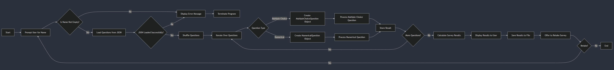
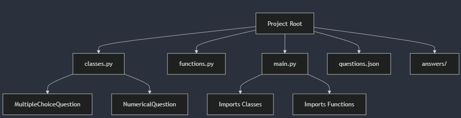

# Final Project: Fahrschule Survey

## Project Guidelines

### Documentation: A Guideline

Project Title: Fahrschule Umfrage
Participants: Felipe Meloni

#### Project Structure

How did you set up this project?

Structure: This project was structured to get answers for the Fahrschule test in english. The main components are:

- Questions repositories: JSON file containing the questions in such a manner to have the ID, question type (numerical or multiple choice), the question string and a list (dictionary) of answers optioins containing the answer text and if it is correct or numerical value for multiplechoice questions or the correct numerical value and mesuring unit for numerical questions.
- Classes script: I created two classes to recieve, exibit on terminal, collect and handle the answer accordingly to the question type (multichoice or numerical).
- Main scipt: A main script with all functions that appeared necessary while developing the project and handling the main logic of reading the JSON file, ramdomize order, identifying the question type, calling the correct class to handle the question, storing if questions are correct or not in a list and saving the results in a txt file.
- There is a folder created by script to contain all answers

Did you create different scripts for different sections? If yes, how many scripts and what is their content? What are they supposed to calculate?

- Yes, as explained above there are two scripts, one for the questions classes and another for the main functions and logic.

#### Flowchart

- How does your solution for the project work?
- <https://www.geeksforgeeks.org/an-introduction-to-flowcharts/>

#### Problems

Were there significant issues at certain points that prevented you from making as much progress as you wanted? If so, how did you solve them? What was the problem?

- Yes, the first problem was figuring out how to store the questions informations to be later interpreted. I first tried using txt but parsing got dificult recognizing when one question ended and other started and recognize the quesitons type. I switched to JSON that better handles the content format and can be easily handled using json library in Python
- Another problem was thinking how to handle user input for multiple questions since there are many ways the user can separate the options and it should be user friendly even without using a mouse so I used regular expressions to handle different separators.
- A also forced some errors on the program to test and create a better error handling for TypeErrors.

Are there still any errors in the program? If yes, at which point? What is going wrong there? For example, is a variable being created with the wrong type but you couldn't figure out where the problem was?

- Not that I am aware of =D

Please include screenshots of any issues so that I can understand them!

### Project 3: Survey

Create a Survey Tool. A file containing questions and possible answers should be read. The questions and possible answers should be displayed to the user. The user can then answer the question. Ensure that the correct data types are used! The completed data set is then appended to a file.

Minimum Requirements:

- Read the file (e.g., .txt file) and create the survey
- Include at least one multiple-choice question and one numerical question
- Ability to retake the survey without overwriting previous responses
- Save responses for possible further processing
Optional Additional Tasks:
- Graphical User Interface (GUI)
- Input of questions and answer options in the user interface or a separate script (.json can be useful here)
Survey Points
Import questions/answers 10
Creating survey from input 10
ask numerical questions 5
ask multiple choice
question 5

## Implementation Documentation

### Minimal components

- DONE Create a json repository with questions. Essential for structured data handling.
- DONE Write code to read the json file and create the survey.  Core functionality for dynamic survey generation.
- DONE Define how the survey will be presented to user and explain how he should answer multiple choice and numerical questions. Important for user experience and clarity. Ensures data integrity and proper input validation.
- DONE for numerical must accept float and int and commas ',' and dots '.'as separators. Anything else generate exeption. Allows flexibility in user responses, accommodating various input styles.
- DONE for multiple choice (max 4 answers) accept any type of separotor of numericals. Ex: 12; 1,2; 1 - 2; 1 2. Allows flexibility in user responses, accommodating various input styles.
- DONE Save answers on the end as an txt file on a specific folder with name, date and time as title of txt file. Critical for data persistence and future processing.
- DONE Show results and offer to retake survey. Enhances user engagement and allows multiple attempts without data loss.

### Further improvements

- DONE Error Handling and Validation: Implement comprehensive error handling to manage unexpected inputs or file read/write errors gracefully. Enhances user experience by preventing crashes and providing meaningful feedback.
- DONE Write documentation

### Possible optional features to implement later on

- doing GUI interface using Django
- todo Adding questions that contain pictures
- DONE User Authentication: Allow users to enter their names or IDs before taking the survey. Facilitates personalized data storage and tracking
